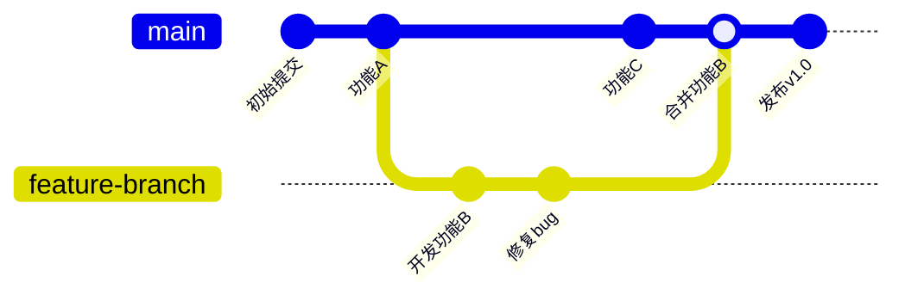
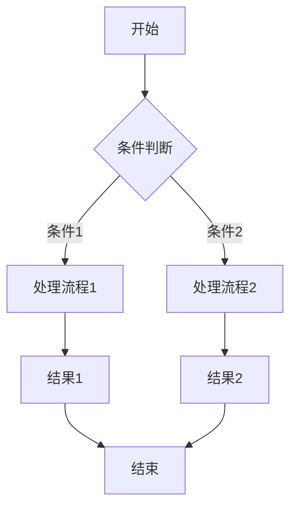
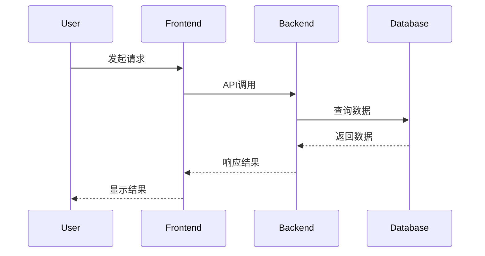
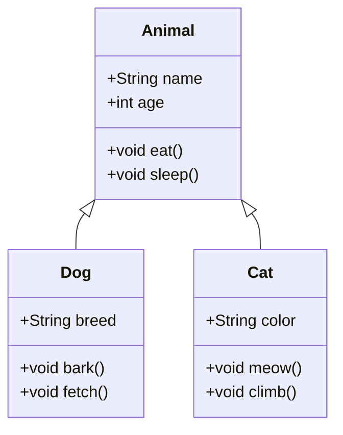
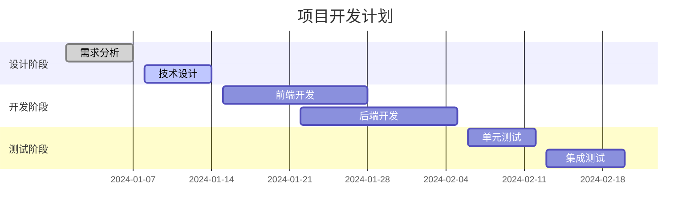
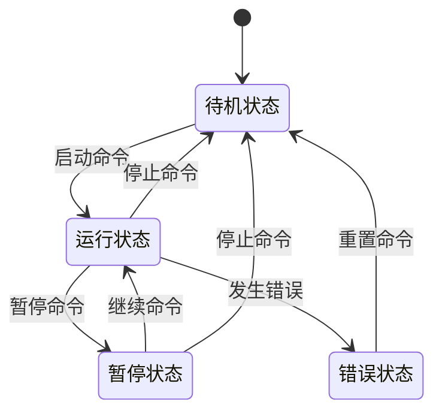
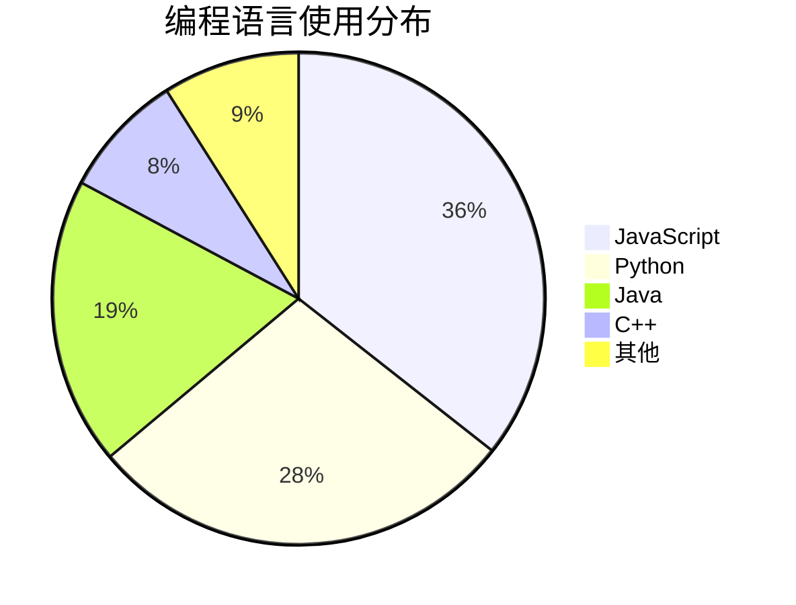
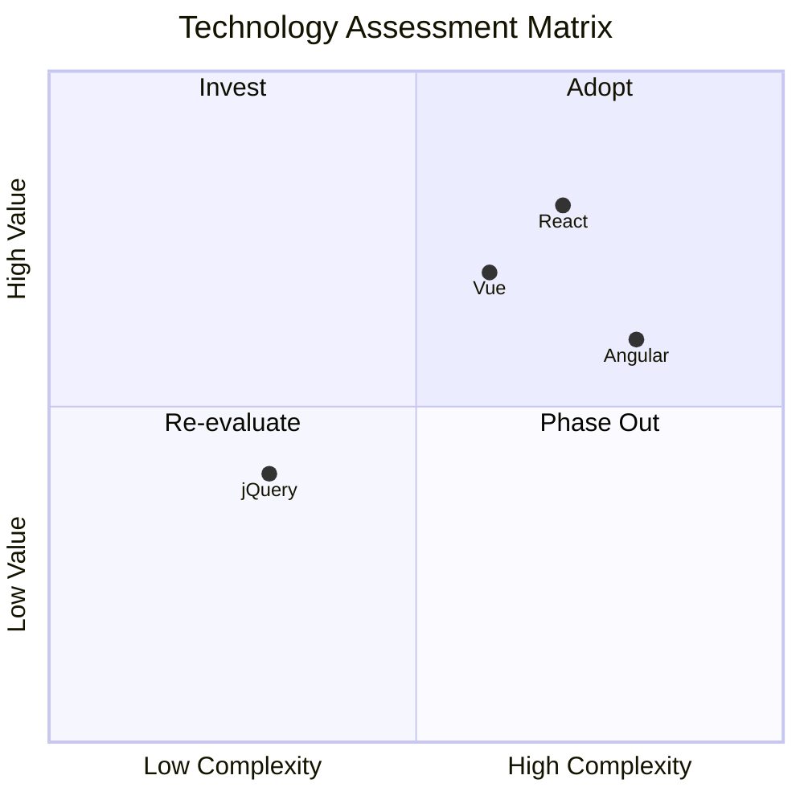
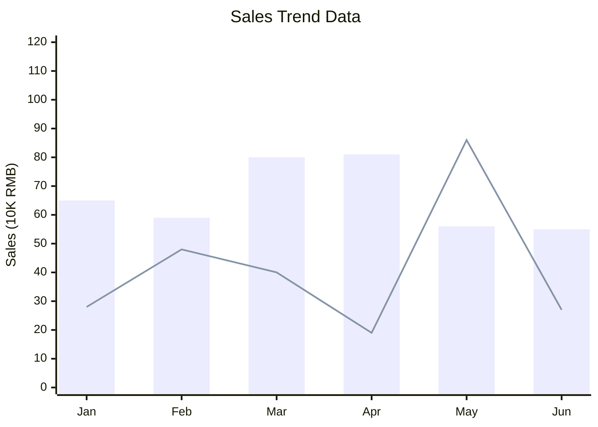

# Markdown 格式示例大全

## 1. 基础文本格式

### 标题级别

# 一级标题

## 二级标题

### 三级标题

#### 四级标题

##### 五级标题

###### 六级标题

### 文本样式

**粗体文本**
*斜体文本*
***粗斜体文本***
~~删除线文本~~
`<u>`下划线文本`</u>`

### 引用块

> 这是一个引用块
> 可以包含多行内容
>
>> 嵌套引用
>>

### 列表

#### 无序列表

- 项目一
- 项目二
  - 子项目一
  - 子项目二
- 项目三

#### 有序列表

1. 第一项
2. 第二项
   1. 子项一
   2. 子项二
3. 第三项

#### 任务列表

- [X] 已完成任务
- [ ] 待完成任务
- [ ] 另一个任务

## 2. 代码块示例

### C++ 代码

```cpp
#include <iostream>
#include <vector>

class Example {
private:
    int value;
    std::vector<int> data;
  
public:
    Example(int val) : value(val) {}
  
    void addData(int num) {
        data.push_back(num);
    }
  
    void print() const {
        std::cout << "Value: " << value << std::endl;
        for (const auto& item : data) {
            std::cout << item << " ";
        }
        std::cout << std::endl;
    }
};

int main() {
    Example ex(42);
    ex.addData(1);
    ex.addData(2);
    ex.addData(3);
    ex.print();
    return 0;
}
```

### Java 代码

```java
import java.util.ArrayList;
import java.util.List;

public class Example {
    private int value;
    private List<Integer> data;
  
    public Example(int value) {
        this.value = value;
        this.data = new ArrayList<>();
    }
  
    public void addData(int num) {
        data.add(num);
    }
  
    public void print() {
        System.out.println("Value: " + value);
        for (int item : data) {
            System.out.print(item + " ");
        }
        System.out.println();
    }
  
    public static void main(String[] args) {
        Example ex = new Example(42);
        ex.addData(1);
        ex.addData(2);
        ex.addData(3);
        ex.print();
    }
}
```

### Shell 脚本

```bash
#!/bin/bash

# 这是一个示例脚本
echo "开始执行脚本..."

# 检查参数
if [ $# -eq 0 ]; then
    echo "错误：请提供参数"
    exit 1
fi

# 循环处理参数
for arg in "$@"; do
    echo "处理参数: $arg"
    # 模拟处理
    sleep 1
done

echo "脚本执行完成"
```

### CMake 配置

```cmake
cmake_minimum_required(VERSION 3.10)
project(MyProject)

# 设置C++标准
set(CMAKE_CXX_STANDARD 17)
set(CMAKE_CXX_STANDARD_REQUIRED True)

# 查找依赖包
find_package(Boost REQUIRED COMPONENTS filesystem system)

# 添加可执行文件
add_executable(my_app main.cpp)

# 链接库
target_link_libraries(my_app ${Boost_LIBRARIES})

# 包含目录
target_include_directories(my_app PRIVATE ${CMAKE_CURRENT_SOURCE_DIR}/include)
```

### Log 文件示例

```log
2024-01-15 10:30:25 INFO  [main] Application started successfully
2024-01-15 10:30:26 DEBUG [worker-1] Processing request ID: 12345
2024-01-15 10:30:27 WARN  [worker-2] Slow query detected: 2.5s
2024-01-15 10:30:28 ERROR [worker-3] Database connection failed
2024-01-15 10:30:29 INFO  [main] Shutting down application
```

### Python 代码

```python
import asyncio
from typing import List, Optional

class DataProcessor:
    def __init__(self, data: List[int]):
        self.data = data
        self.results = []
  
    async def process_item(self, item: int) -> Optional[int]:
        """异步处理单个项目"""
        await asyncio.sleep(0.1)  # 模拟异步操作
        if item > 0:
            return item * 2
        return None
  
    async def process_all(self) -> List[int]:
        """批量处理所有数据"""
        tasks = [self.process_item(item) for item in self.data]
        results = await asyncio.gather(*tasks)
        self.results = [r for r in results if r is not None]
        return self.results

# 使用示例
async def main():
    processor = DataProcessor([1, 2, 3, -1, 5])
    results = await processor.process_all()
    print(f"处理结果: {results}")

if __name__ == "__main__":
    asyncio.run(main())
```

## 3. Mermaid 图表

### Git 分支图



### 流程图



### 序列图



### 类图



### 甘特图



### 状态图



### 饼图



### 象限图



### XY-Axis图表



## 4. 数学公式

### 行内公式

这是一个行内公式：$E = mc^2$，还有勾股定理：$a^2 + b^2 = c^2$。

### 块级公式

#### 二次方程求根公式

$$
x = \frac{-b \pm \sqrt{b^2 - 4ac}}{2a}
$$

#### 欧拉公式

$$
e^{i\pi} + 1 = 0
$$

#### 积分公式

$$
\int_{-\infty}^{\infty} e^{-x^2} dx = \sqrt{\pi}
$$

#### 矩阵运算

$$
\begin{bmatrix}
1 & 2 \\
3 & 4
\end{bmatrix}
\times
\begin{bmatrix}
5 & 6 \\
7 & 8
\end{bmatrix}
=
\begin{bmatrix}
19 & 22 \\
43 & 50
\end{bmatrix}
$$

#### 极限公式

$$
\lim_{x \to 0} \frac{\sin x}{x} = 1
$$

## 5. 表格

### 基础表格

| 姓名 | 年龄 | 城市 | 职业     |
| ---- | ---- | ---- | -------- |
| 张三 | 25   | 北京 | 工程师   |
| 李四 | 30   | 上海 | 设计师   |
| 王五 | 28   | 广州 | 产品经理 |

### 对齐表格

| 左对齐     | 居中对齐 | 右对齐 |
| :--------- | :------: | -----: |
| 文本1      |  文本2  |    100 |
| 长文本示例 | 居中文本 | 123.45 |

### 复杂表格

| 项目 | 第一季度 | 第二季度 | 第三季度 | 第四季度 | 总计    |
| ---- | -------- | -------- | -------- | -------- | ------- |
| 收入 | 100,000  | 120,000  | 150,000  | 180,000  | 550,000 |
| 成本 | 60,000   | 70,000   | 80,000   | 90,000   | 300,000 |
| 利润 | 40,000   | 50,000   | 70,000   | 90,000   | 250,000 |

## 6. 五线谱示例

### 简单旋律

```abc
X:1
T:小星星
M:4/4
L:1/4
K:C
| C C G G | A A G2 | F F E E | D D C2 |
| G G F F | E E D2 | G G F F | E E D2 |
| C C G G | A A G2 | F F E E | D D C2 |
```

### 和弦进行

```abc
X:2
T:和弦示例
M:4/4
L:1/4
K:C
%%score (T1 T2) (B1 B2)
[V:T1] "C"c2 c2 | "G"g2 g2 | "Am"a2 a2 | "F"f2 f2 |
[V:T2] e2 e2 | d2 d2 | c2 c2 | A2 A2 |
[V:B1] C,2 C,2 | G,2 G,2 | A,2 A,2 | F,2 F,2 |
[V:B2] E,2 E,2 | D,2 D,2 | C,2 C,2 | A,2 A,2 |
```

## 7. 其他格式

### 脚注

这是一个带有脚注的句子[^1]。

[^1]: 这是脚注的内容。
    
### 定义列表

术语1
: 这是术语1的定义

术语2
: 这是术语2的定义
: 可以有多个定义

### 高亮文本

==这是高亮文本==

### 上标和下标

H~2~O 是水的化学式，E=mc^2^ 是质能方程。

### 键盘快捷键

按 `<kbd>`Ctrl`</kbd>` + `<kbd>`C`</kbd>` 复制，按 `<kbd>`Ctrl`</kbd>` + `<kbd>`V`</kbd>` 粘贴。

## 8. 链接和图片

### 外部链接

[Google](https://www.google.com)
[GitHub](https://github.com)

### 内部链接

[跳转到代码块](#2-代码块示例)

### 图片


### 带标题的图片

<figure>
    
    <figcaption>这是一个带标题的图片示例</figcaption>
</figure>

## 9. 折叠内容

<details>
<summary>点击展开详细内容</summary>

这里是折叠起来的内容，可以包含各种格式：

- 列表项
- 另一个列表项

```python
print("折叠区域内的代码")
```

</details>

## 10. 表情符号和特殊字符

### 常用表情符号

😄 ❤️ ⭐️ 🚀 📚 💻 💡 ⚠️

### 数学符号

∀ ∃ ∈ ∉ ⊂ ⊃ ∪ ∩ ∅ ∞ √ ∫ ∑ ∏ ∂ ∇

### 箭头符号

← → ↑ ↓ ↔ ↕ ⇐ ⇒ ⇔ ⇑ ⇓ ⇕

---

*本文档展示了Markdown的各种格式和功能，可以作为学习和参考使用。*
